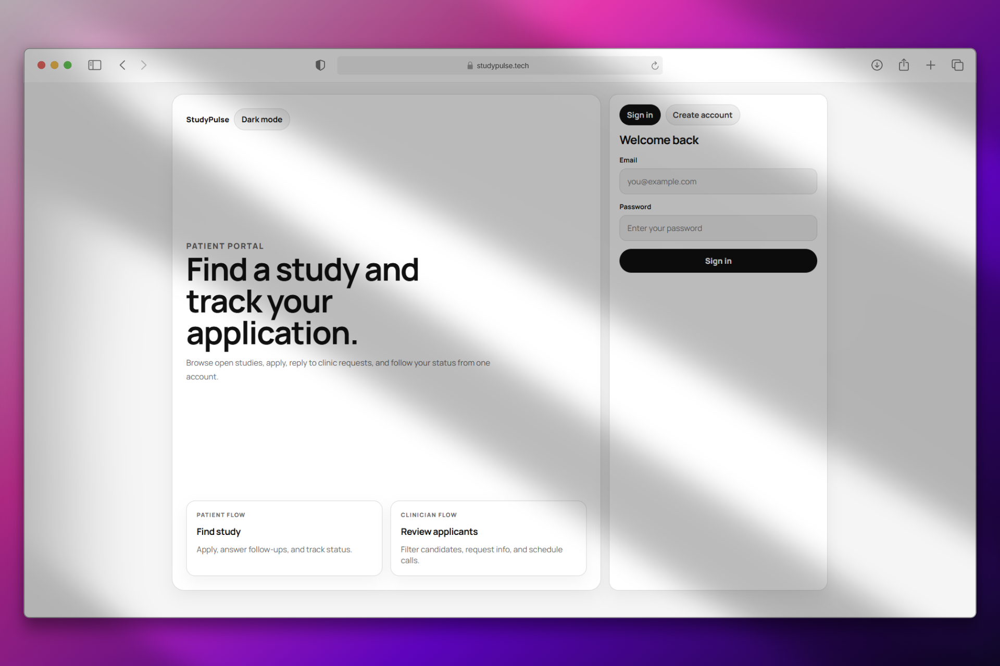
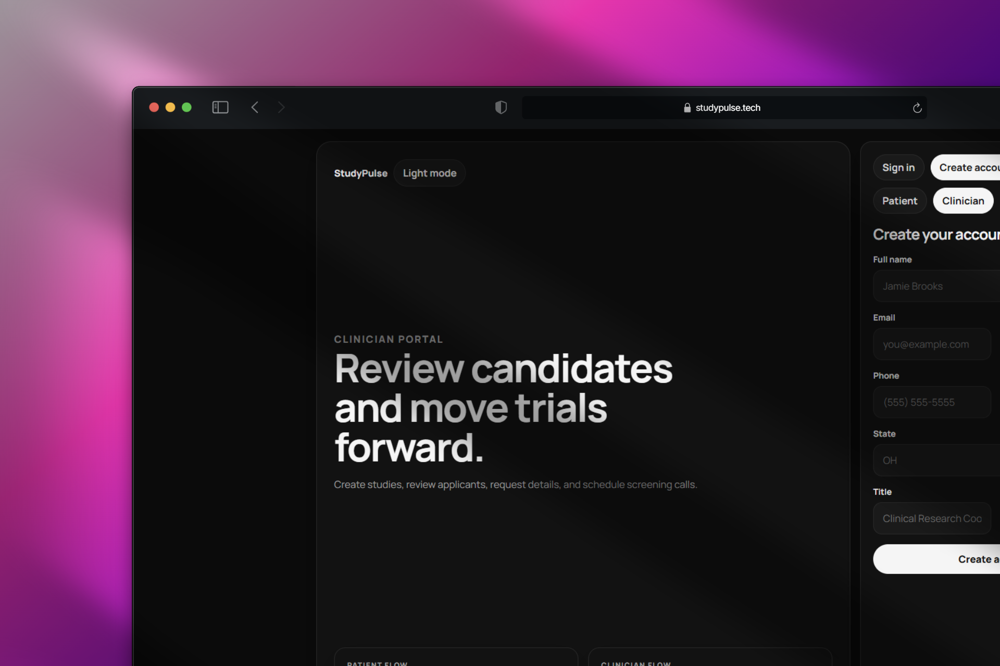
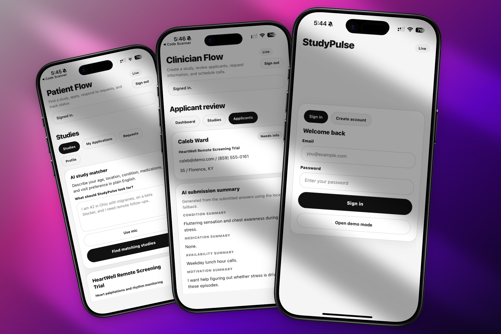
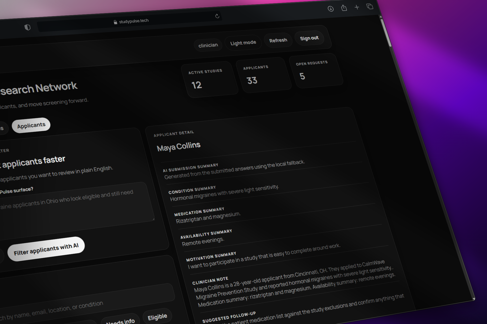
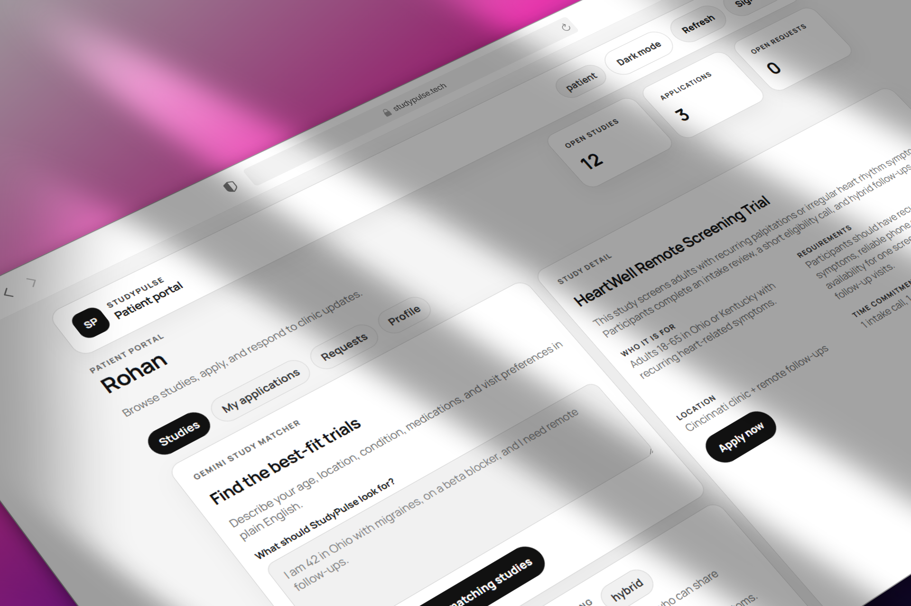

# StudyPulse

StudyPulse is a clinical trial recruitment and screening platform built for the Medpace sponsor challenge at RevolutionUC 2026.

It includes:

- a patient-facing Expo React Native mobile app
- a shared web portal for patients and clinicians
- one Supabase backend for auth, studies, applications, requests, and status updates

The product is designed around one core workflow:

**Find study -> Apply -> Review -> Request info -> Update status -> Schedule call**

## Screenshots

<div align="center">

| | | |
|:---:|:---:|:---:|
|  |  |  |
|  |  | |

</div>

## Why StudyPulse

Clinical trial recruitment is often slow, manual, and fragmented. Patients do not always know which studies fit them, and coordinators spend too much time reviewing incomplete applications and chasing missing information.

StudyPulse focuses on the front door of the trial process:

- helping patients discover likely-matching studies
- helping clinicians triage large applicant pools faster
- keeping follow-up requests and status updates in one shared system

## Core Features

- Shared login across mobile and web using Supabase Auth
- Shared database for studies, applications, screening requests, and statuses
- Patient and clinician experiences separated into distinct flows
- Natural-language study matching for patients
- Natural-language applicant filtering for clinicians
- AI-generated clinician-facing summaries from patient free-text answers
- Voice input for patient and clinician search using speech-to-text
- Demo fallback data when Supabase is not configured

## Tech Stack

### Mobile

- Expo
- React Native
- TypeScript

### Web

- React
- Vite
- TypeScript

### Backend and data

- Supabase
- PostgreSQL
- Supabase Auth

### AI and voice

- Gemini API for matching and summaries
- ElevenLabs Speech-to-Text for voice input

## Repository Structure

```text
.
|-- App.tsx                    # Mobile app entry
|-- src/
|   |-- screens/               # Mobile patient, clinician, and auth screens
|   |-- hooks/                 # Shared app state and voice hooks
|   |-- lib/                   # Supabase, AI, repository, and API helpers
|   |-- data/                  # Seeded demo data
|   |-- components/            # Mobile UI primitives
|   |-- theme/                 # Theme tokens
|   `-- types/                 # Shared mobile types
|-- web/
|   `-- src/
|       |-- App.tsx            # Web app entry
|       |-- components/        # Web auth, patient, and clinician views
|       |-- hooks/             # Web voice hooks
|       `-- lib/               # Web Supabase and API helpers
|-- supabase/
|   |-- schema.sql             # Full schema + seed setup
|   `-- patch_profiles_and_studies.sql
`-- README.md
```

## Local Development

### Prerequisites

- Node.js 20.19+ recommended
- npm
- a Supabase project if you want live data and shared auth

### Install dependencies

```bash
npm install
```

### Install web dependencies

```bash
npm run web:install
```

### Mobile environment

Create a `.env` file from `.env.example`:

```env
EXPO_PUBLIC_SUPABASE_URL=...
EXPO_PUBLIC_SUPABASE_PUBLISHABLE_KEY=...
EXPO_PUBLIC_GEMINI_API_KEY=...
EXPO_PUBLIC_ELEVENLABS_API_KEY=...
```

### Web environment

Create `web/.env` from `web/.env.example`:

```env
VITE_SUPABASE_URL=...
VITE_SUPABASE_PUBLISHABLE_KEY=...
VITE_GEMINI_API_KEY=...
VITE_ELEVENLABS_API_KEY=...
```

## Database Setup

Use the SQL editor in Supabase.

### Fresh setup

Run:

- `supabase/schema.sql`

This creates the schema, functions, policies, and seeded demo data.

### Safe update for an existing project

Run:

- `supabase/patch_profiles_and_studies.sql`

Use this if you already have a working project and only want the incremental profile/study patch.

## Running the Project

### Mobile app

```bash
npm run start
```

Helpful variants:

```bash
npm run android
npm run ios
npm run web
```

### Web portal

```bash
npm run web:dev
```

## Useful Scripts

```bash
npm run typecheck
npm run web:typecheck
npm run web:build
```

## Demo Mode

If Supabase is not configured, the mobile app falls back to seeded local demo data so the product can still be presented.

The repo also includes seeded studies, applicants, and screening requests to make the clinician dashboard and AI matching flows feel realistic during demos.

## Notes

- This repo is optimized for a hackathon demo and MVP workflow.
- Some security and production-hardening work is still intentionally deferred.
- Supabase RLS policies are more permissive than a production healthcare system would require.
- API keys for Gemini and ElevenLabs should be moved behind a backend or edge function before any real deployment.

## Future Improvements

- push and email notifications
- persisted AI screening summaries
- calendar scheduling integrations
- document upload for screening materials
- clinician analytics and funnel reporting
- stricter role-based access control
- backend-proxied AI requests

## License

This project was built for a hackathon prototype/demo. Add the license you want to use before public distribution.
